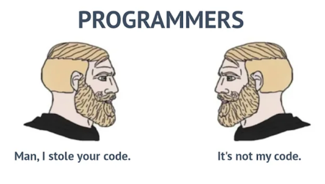

---
date:
  created: 2023-10-01
  updated: 2024-12-12
readtime: 8
pin: true
links:
  - Vault Index: archive/index.md
categories:
  - Vault
tags:
  - Automation
  - Bash Scripting
  - Docker
  - Git
authors:
  - robertovallado
slug: docker-in-the-classroom
---

# Automation in the classroom! PART II - Marking assignments with the help of Docker containers

test

#